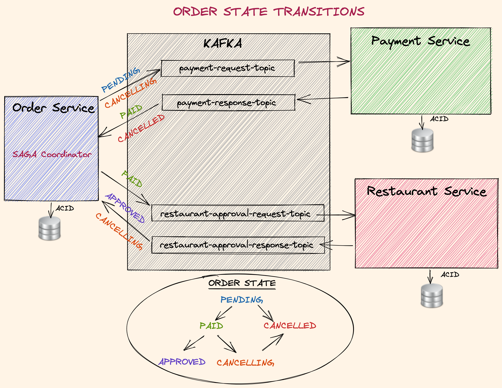

# Food Ordering System - Docs

## Overview
This project is a **distributed food ordering system** built using principles from **Domain-Driven Design (DDD)**, **Hexagonal Architecture**, and asynchronous messaging patterns such as **Kafka**, **SAGA**, and the **Outbox Pattern**. These architectures and patterns were implemented to handle complex workflows, ensure fault tolerance, and maintain data consistency across microservices in the system.


---

## Key Architectural Concepts

### 1. Domain-Driven Design (DDD)
DDD is a software design approach that emphasizes collaboration between domain experts and developers to create software that accurately reflects business requirements. It involves structuring the system into layers:

- **Aggregates**: Represent key domain concepts (e.g., `Order`, `Payment`).
- **Entities** and **Value Objects**: Help encapsulate business logic and ensure domain integrity.
- **Domain Events**: Capture significant changes in the system (e.g., `OrderCreated`, `PaymentCompleted`).

In this project, the domain model is reflected in the `Order Service` and its interaction with other services like `Payment` and `Restaurant`.

---

### 2. Hexagonal Architecture
Also known as the **Ports and Adapters Architecture**, this design separates the core business logic from the outside world:

- **Primary Ports**: Interfaces for receiving input (e.g., REST API calls).
- **Secondary Ports**: Interfaces for sending outputs (e.g., messaging with Kafka).
- **Adapters**: Implementations that handle the interaction with external systems (e.g., Kafka messaging, database access).

In this project, Kafka topics such as `payment-request-topic` and `restaurant-approval-request-topic` serve as secondary adapters for decoupled communication.

---

### 3. Kafka
Kafka is used as the message broker to enable asynchronous communication between microservices. Each service publishes and consumes events to/from specific topics:

- **Order Service** publishes events like `OrderCreated` and consumes responses from other services.
- **Payment Service** listens to `payment-request-topic` and responds on `payment-response-topic`.
- **Restaurant Service** listens to `restaurant-approval-request-topic` and responds on `restaurant-approval-response-topic`.

This setup ensures scalability and resilience, allowing services to operate independently.

---

### 4. SAGA Pattern
The **SAGA Pattern** is used to manage distributed transactions across microservices by coordinating a series of steps. Each service performs its part of the transaction and publishes events to indicate completion or failure:

- **Order Service** acts as the SAGA coordinator, orchestrating steps like payment processing and restaurant approval.
- **Compensating Transactions** are triggered to roll back changes in case of failure (e.g., canceling an order if payment fails).

Refer to the order state transitions diagram for a detailed view:



---

### 5. Outbox Pattern
The **Outbox Pattern** ensures reliable event publishing by using a transactional outbox table:

- Each service writes events to its outbox table as part of a local transaction.
- A separate process publishes these events to Kafka, ensuring **idempotency** and fault tolerance.

This pattern prevents issues like message loss and guarantees eventual consistency across services.

---

## Workflow Example

The following steps describe the order lifecycle:

1. **Order Creation**: The `Order Service` creates an order and publishes an `OrderCreated` event.
2. **Payment Processing**: The `Payment Service` processes the payment and publishes a `PaymentCompleted` event.
3. **Restaurant Approval**: The `Restaurant Service` approves the order and publishes an `OrderApproved` event.
4. **State Transitions**: The `Order Service` updates the order state based on the events received (e.g., `PENDING -> PAID -> APPROVED`).

Refer to the SAGA pattern diagram for a detailed view of the message flow:


---

## Features

- **Resilient Microservices**: Each service is designed to handle failures gracefully through compensating transactions.
- **Scalable Messaging**: Kafka enables seamless communication and horizontal scalability.
- **Decoupled Architecture**: Hexagonal architecture ensures high modularity, making it easy to add or replace components.
- **ACID Compliance**: Local transactions in each service ensure data consistency.

---

## How to Run

1. **Set Up Kafka**: Deploy a Kafka instance with required topics (`payment-request-topic`, `payment-response-topic`, etc.).
2. **Run Services**: Start the `Order`, `Payment`, and `Restaurant` services.
3. **Test the Workflow**: Use Postman or any HTTP client to create orders and observe the state transitions through logs or database queries, you can use the json sample below on the `/orders` endpoint.


```json
{
  "customerId": "d215b5f8-0249-4dc5-89a3-51fd148cfb41",
  "restaurantId": "d215b5f8-0249-4dc5-89a3-51fd148cfb45",
  "address": {
    "street": "street_1",
    "postalCode": "1000AB",
    "city": "Amsterdam"
  },
  "price": 200.00,
  "items": [
    {
      "productId": "d215b5f8-0249-4dc5-89a3-51fd148cfb48",
      "quantity": 1,
      "price": 50.00,
      "subTotal": 50.00
    },
    {
      "productId": "d215b5f8-0249-4dc5-89a3-51fd148cfb48",
      "quantity": 3,
      "price": 50.00,
      "subTotal": 150.00
    }
  ]
}
```


---

## Future Enhancements
- Implement a **Materialized View** for faster querying using the **CQRS Pattern**.
- Add monitoring dashboards for Kafka metrics and service health.
- Extend the system to handle retries and delays in message delivery.

---

This project demonstrates the power of combining modern architectural patterns to build a robust and scalable distributed system.
